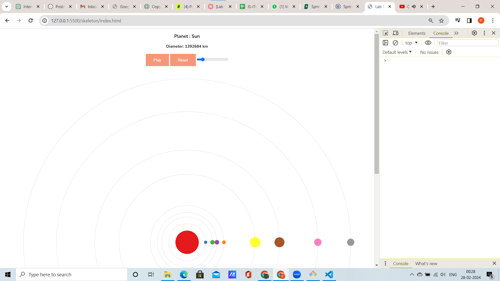

# Solar System Visualization using D3.js

## **Overview**
This project visualizes a solar system using **D3.js** and **SVG** elements. The visualization incorporates planetary orbits, planet sizes, and interactivity through tooltips, play/pause controls, speed adjustment, and reset functionality. The planets rotate around the sun based on their revolution periods, creating an accurate and engaging representation of the solar system.

---

## **Implementation Details**

### **Part 1: Static Visualization**

#### **1. Data Loading and Parsing**
- The solar system dataset is loaded from a TSV file using `d3.tsv()`.
- The dataset attributes (`Diameter`, `Distance`, `Revolution`) are converted to numerical values for calculations.
- The parsed data is stored in a structured `planetsData` object, indexed by planet names for efficient access.

#### **2. Scales**
- **Distance Scale**:
  - A power scale (`d3.scalePow`) is used to calculate orbit radii based on the distance of each planet from the sun.
  - Range: `[0, height / 2 - 30]`.
- **Diameter Scale**:
  - A power scale (`d3.scalePow`) is used to determine planet sizes based on their diameters.
  - Range: `[0, 30]`.
- **Color Scale**:
  - An ordinal scale (`d3.scaleOrdinal`) maps planet names to unique colors using the `d3.schemeSet1` color scheme.

#### **3. Orbits**
- A group (`<g>`) element is created for orbits with the ID `orbits`.
- Each orbit is represented as a `<circle>` element with:
  - **Attributes**:
    - `cx`/`cy`: Centered at the sun.
    - `r`: Radius based on the distance scale.
    - `fill`: None.
    - `stroke`: Lightgray.
    - `stroke-width`: 0.5.

#### **4. Planets**
- A group (`<g>`) element is created for planets with the ID `planet-g`.
- Nested `<g>` elements are created for each planet, identified by their names.
- Each planet is represented as a `<circle>` element with:
  - **Attributes**:
    - `cx`/`cy`: Positioned on the orbit based on distance from the sun.
    - `r`: Radius based on the diameter scale.
    - `fill`: Color based on the planet name.
- **Interactivity**:
  - **Tooltips**:
    - Display planet details (`Name` and `Diameter`) on hover.
    - Tooltips appear only when the animation is paused.
    - Tooltips are hidden when the mouse leaves the planet.

---

### **Part 2: Interactivity and Animation**

#### **1. Play/Pause Button**
- A button is added to control the animation state:
  - **Default Value**: "Play".
  - Toggles between "Play" and "Pause" when clicked.
  - Updates the `isActive` variable to determine animation status.

#### **2. Reset Button**
- A reset button is added to reset all planet positions to their initial states:
  - Only resets when the animation is paused.

#### **3. Speed Slider**
- A slider is added to adjust the rotation speed of the planets:
  - **Range**: `[0.1, 2]`.
  - **Step**: `0.01`.
  - Updates the `speed` variable dynamically.

#### **4. Revolution Scale**
- A symmetric logarithmic scale (`d3.scaleSymlog`) is created to map revolution periods to rotation speeds:
  - **Range**: `[10, 1]`.
  - **Domain**: Derived from the `revolution` attribute of planets, excluding the sun.

#### **5. Animation Function**
- A function animates planetary rotation based on:
  - Revolution period (scaled using the revolution scale).
  - Rotation speed (adjusted by the slider).
  - **Transformation**:
    - Planets are rotated around the sun using `transform` attributes.
    - Rotation angle: `(rotation speed * revolution * idx * speed) % 360`.

---

## **Visualization Features**
1. **Orbits**:
   - Represented by circles centered around the sun, proportional to each planet's distance.
2. **Planets**:
   - Colored circles positioned on their respective orbits.
   - Scaled sizes based on diameters.
3. **Interactivity**:
   - **Tooltips**: Display planet details on hover.
   - **Play/Pause Control**: Toggle animation state.
   - **Speed Slider**: Adjust the rotation speed.
   - **Reset Button**: Reset planet positions to their initial states.
4. **Animation**:
   - Planets rotate around the sun based on their revolution periods.
   - Rotation speed and direction dynamically adjusted.

---

## **Files and Structure**
- **HTML File**: `index.html`
  - Contains the SVG canvas and control elements.
- **JavaScript File**: `main.js`
  - Handles data loading, scales, drawing, interactivity, and animation logic.
- **Dataset**: `solarSystem.tsv`
  - Contains the solar system data with attributes for each planet.

---

## **Example Output**
- A dynamic and interactive SVG visualization of the solar system.
- Features planetary orbits, planet sizes, and animations with full control.

